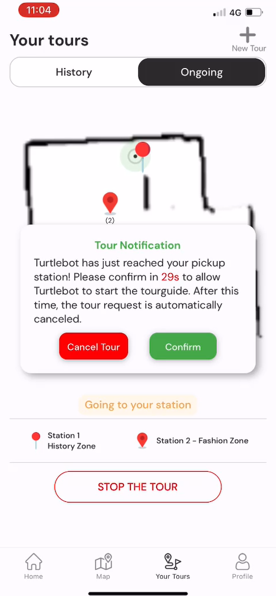

## Introduction
Imagine exploring an exhibition with a personalized robot guide by your side! **iTourbot** connects you with a friendly robot who can navigate you to specific station in a exhibit, share their fascinating details. No more aimlessly wandering or missing hidden gems - **iTourbot** makes your exhibition experience enriching and interactive!

'i' in **iTourbot** stands for *"internet, individual, instruct, inform and inspire"*

## Demo 
<div style="display: flex; justify-content: space-between;">
    
    
    
</div>
<br/>
<div style="display: flex; justify-content: space-between;">
    
    
    
</div>


## 🚀 How to use
Setup environment (.env file), you can see in .env.example
```
# Firebase config
EXPO_PUBLIC_APIKEY=
EXPO_PUBLIC_DATABASE_URL=
EXPO_PUBLIC_PROJECT_ID=
EXPO_PUBLIC_APP_ID=
# API URL config
EXPO_PUBLIC_BASE_API_URL=
```
Install packages
```sh
npm install
```
Run the project (locally)
```sh
npm start
```
Run the project with tunnel mode (project can be opened with devices in different network)
```sh
npm run tunnel
```
## Backend Services
Follow [this repository](https://github.com/khangng2611/itourbot)


## 🚀 How to use
Setup environment (.env file), you can see in .env.example
```
    # Firebase config
    EXPO_PUBLIC_APIKEY=
    EXPO_PUBLIC_DATABASE_URL=
    EXPO_PUBLIC_PROJECT_ID=
    EXPO_PUBLIC_APP_ID=
    # API URL config
    EXPO_PUBLIC_BASE_API_URL=
```

Install packages
```sh
npm install
```

Run the project (locally)
```sh
npm start
```

Run the project with tunnel mode (project can be opened with devices in different network)
```sh
npm run tunnel
```

## Backend Services
Follow [this repository](https://github.com/khangng2611/itourbot)
